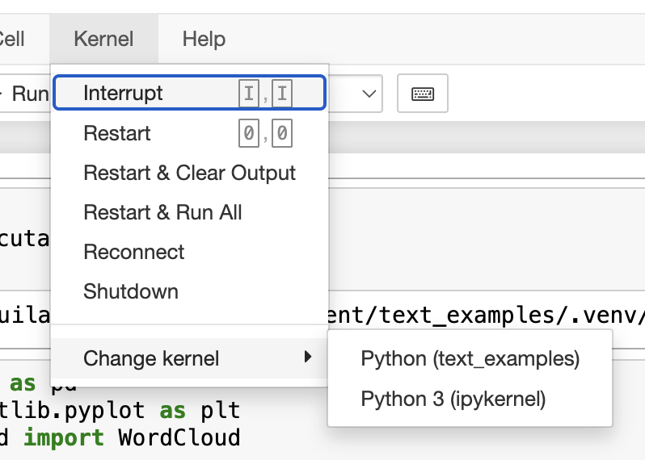

# Ejemplos de procesamiento de texto

## Instalación

### Crear el ambiente virtual de Python:

1. Crear el ambiente

```
python -m venv .venv
conda create --prefix ./.venv python=3.11
```

2. Activar el ambiente

```
source .venv/bin/activate
conda activate ./.venv
```

3. Instalar dependencias

```
pip install pandas matplotlib wordcloud nltk jupyter ipykernel PyPDF2 unidecode contractions spacy 
pip install textblob transformers ace_tools scikit-learn sentence-transformers openai
```
Nota: Puede ser necesario crear un nuevo ipkernel para que utilice el ambiente, se hace con la instrucción:

```
python -m ipykernel install --user --name=text_examples_venv --display-name="Python (text_examples)"
```

4. (Opcional))Instalar Pytorch con soporte de aceleración

Documentación: [INSTALL PYTORCH](https://pytorch.org/)

Para macOS ARM:

```
pip install torch torchvision torchaudio
```

Luego validar la acceleración:
```
python -c "import torch; print(torch.backends.mps.is_available())"
```

Para nVidia:

```
pip3 install torch torchvision torchaudio --index-url https://download.pytorch.org/whl/cu124
python -c "import torch; print(torch.cuda.is_available())"
```

5. (opcional) Desactivar el ambiente

```
conda deactivate
```

## Obtener documentos

Para probar el analisis de texto, utilizamos los siguientes PDFs de articulos científicos que se han referenciado en el curso:

* [Attention is all you need](https://arxiv.org/pdf/1706.03762)
* [The Google File System](https://static.googleusercontent.com/media/research.google.com/en//archive/gfs-sosp2003.pdf)
* [Efficient Estimation of Word Representations in Vector Space](https://arxiv.org/pdf/1301.3781)
* [Porter Stemmer](https://people.scs.carleton.ca/~armyunis/projects/KAPI/porter.pdf)

Copiar estos PDFs al directorio `pdf/`.

## Ejecutar el Jupyter notebook:

```
jupyter notebook
```

### Seleccionar el kernel correcto

En caso que de problemas de dependencias, seleccionar el kernel correcto en el notebook:


